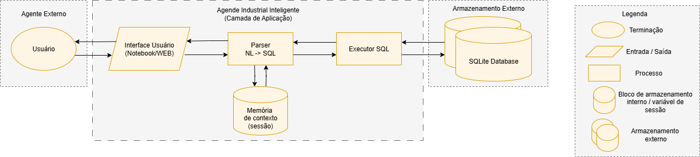

# Desafio\_FIESC: Agente Industrial Inteligente

## 1. Explicação do Projeto

O **Desafio\_FIESC** consiste em desenvolver um agente conversacional que interpreta perguntas em **linguagem natural** e as traduz em consultas **SQL** executadas em um banco de dados SQLite. O objetivo é permitir que operadores de chão de fábrica, engenheiros de manutenção e gestores obtenham informações sobre equipamentos, ordens de manutenção e técnicos sem precisar conhecer SQL.

## 2. Como Executar o Código

1. **Clone o repositório**:

   ```bash
   git clone https://github.com/bryanambrosio/desafio_FIESC.git
   cd desafio_FIESC
   ```

2. **Prepare o ambiente** (recomendado usar Conda):

   ```bash
   conda env create -f environment.yml
   conda activate desafio_FIESC
   ```

   ou, usando `pip`:

   ```bash
   python -m venv venv
   source venv/bin/activate   # no Windows: venv\Scripts\activate
   pip install -r requirements.txt
   ```

3. **Abra o JupyterLab**:

   ```bash
   jupyter lab
   ```

4. **No JupyterLab**, abra o notebook `desafio_FIESC.ipynb`, selecione o kernel **Python (desafio\_FIESC)** e execute todas as células (Run All).

## 3. Exemplos de Perguntas Suportadas

* Quais equipamentos estão atualmente em manutenção?
* Liste as ordens abertas no setor A.
* Quem são os técnicos de elétrica no turno noturno?
* Qual foi o tempo médio de manutenção corretiva das bombas?
* Liste as ordens concluídas.
* Quais ordens foram abertas nos últimos 7 dias?
* Quantos técnicos existem por especialidade?
* Quem trabalhou na ordem 3?

## 4. Limitações e Sugestões de Melhoria

* **Regras estáticas**: o parser utiliza padrões fixos de palavras-chave e regex; não há NLU avançado.
* **Contexto básico**: ainda não suporta memória de contexto para perguntas encadeadas.
* **Consultas complexas**: falta suporte a junções multitas (joins) e filtros dinâmicos genéricos.

## Diagrama de Arquitetura

Abaixo, uma representação do fluxo de interação entre os componentes do agente:

<p align="center">
  
</p>

1 - Usuário faz perguntas em linguagem natural.

2 - A UI (notebook ou web) recebe e exibe tanto a pergunta quanto a resposta.

3 - O Parser NL→SQL traduz NL em SQL, consultando e atualizando a Memória de Contexto para manter o histórico de entidades (como último ID de ordem).

4 - O Executor SQL recebe a query pronta e a executa no SQLite Database, retornando os resultados para a UI
